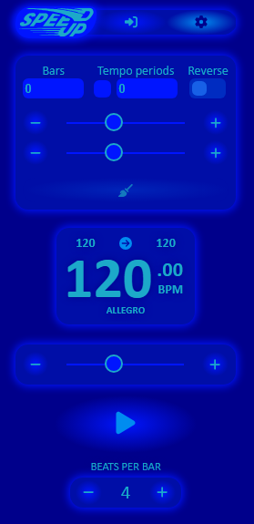

# 🎵 SpeedUpVueDemo-Frontend

> **SpeedUp** is a smart metronome designed for musicians who want to develop consistent tempo control 
> and master difficult musical passages. It features a user-friendly interface, customizable settings, 
> and advanced metronome functionalities.
> This tool is especially useful for practicing difficult or complex passages in music,
> allowing musicians to gradually increase their speed and accuracy.

This is the **Vue 3 demo frontend** is shared for portfolio and recruitment purposes.
The core metronome engine logic has been intentionally removed to protect intellectual property.

🔗 **Try the live demo:** [https://speedup.yurkinsson.com](https://speedup.yurkinsson.com)

---

## 🎯 Key Features

- 🎚️ **Start and end tempo**
- ⏱️ **Number of bars per training round**
- 🔁 **Number of tempo shifts per round**
- 🔄 **Loop mode**: reverse tempo or reset to start
- ⚠️ **Limit of 3 saved presets** per user (in this version)

---

## 🧩 Tech Stack

### Frontend
- **Vue.js 3** with Composition API
- **Vuex** for state management
- **Axios** for backend communication
- **Responsive layout** using Flexbox
- **Vite** development server

### Backend (not included in this repository)
- ASP.NET (Controllers + Minimal API)
- MariaDb + Entity Framework Core
- JWT authentication, Rate limiting, Filtering, CORS

> 🔒 The backend and domain logic are in a private repository.
> Access is available upon request for recruiters and potential collaborators.
> Just message me via [LinkedIn](https://www.linkedin.com/in/yury-podlevskikh/) or [GitHub](https://github.com/Yurypodlevskikh).

---

## 🧪 Testing

Unit tests are implemented for key business logic like metronome template validation and repository behavior.

---

## 🚀 Deployment

- Deployed to a shared Windows hosting environment with ASP.NET support
- Manual deployment using `msdeploy.exe`

---

## 📦 Project Setup (for inspection only)

```bash
npm install
npm run dev
```

⚠️ This frontend is not intended for local production use.
Some critical logic is intentionally removed for intellectual property protection.

🖼️ Screenshots

### Main Page


### Settings Page


### Login and Registration


### Presets Page


---

🙌 Author

Made with ❤️ by Yury Podlevskikh (Yurkinsson)
Frontend, backend and full architecture — built solo.

---

## 📄 License

This project is licensed under the **Creative Commons Attribution-NonCommercial 4.0 International License**.  
See the [`LICENSE`](./LICENSE) file for details.
